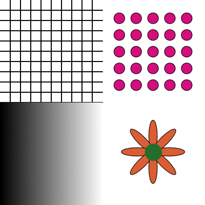

# Processing Task 6 - Loops

## Learning Objectives
In this task, you will learn about using loop patterns to draw sequences of objects.

## Step 1 - Lesson
Acquire the learning objectives by reviewing [this page](https://happycoding.io/tutorials/processing/for-loops)

## Step 2 - Task

Demonstrate your learning objectives by using loops to reproduce the graphic above, such that:

* Quadrant 1 is a 10 x 10 grid that scales to with the size of window.
* Quadrant 2 is 5 x grid of evenly spaced circles that scales to the size of the window.
* Quadrant 3 is a horizontal grayscale gradient 
* Quadrant 4 is a 8 petal flower that uses a loop to draw the petals evenly spaced around the center of the flower.

### Evaluation

#### Level 2
Successfully implements quadrant 1 & 2

#### Level 3
Successfully implements quadrant 1, 2, and 3

#### Level 4
Successfully implements all quadrants.

## Submission
1. Commit and push your code to this repository
2. Take a screenshot of your work and upload it to the Google Classroom assignment post.
